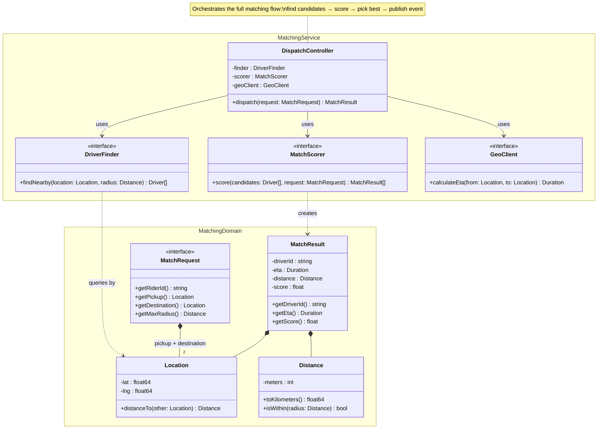

# Code Diagram (Level 4)

Uses Mermaid's **classDiagram** syntax (UML-compliant class diagrams).

## Syntax

```
classDiagram
    direction TB
```

### Define Classes

```
class ClassName {
    +publicField : Type
    -privateField : Type
    #protectedField : Type
    +publicMethod(param: Type) ReturnType
    -privateMethod() void
    #protectedMethod() Type
}
```

Visibility prefixes:
- `+` Public
- `-` Private
- `#` Protected
- `~` Package/Internal

Classifiers (appended after method/field):
- `*` Abstract method: `+doThing()* void`
- `$` Static: `+getInstance()$ Singleton`

### Annotations

```
class MyInterface {
    <<interface>>
    +doSomething() void
}

class MyAbstract {
    <<abstract>>
    +template()* void
}

class Status {
    <<enumeration>>
    PENDING
    ACTIVE
    COMPLETED
}
```

### Relationships

```
ClassA <|-- ClassB         : Inheritance (B extends A)
ClassA *-- ClassB          : Composition (A owns B)
ClassA o-- ClassB          : Aggregation (A has B)
ClassA --> ClassB          : Association (A uses B)
ClassA ..> ClassB          : Dependency
ClassA ..|> InterfaceA     : Realization (implements)
```

### Labels and Cardinality

```
ClassA "1" --> "*" ClassB : contains
ClassA "1" *-- "0..*" ClassB : label
```

Cardinality options: `1`, `0..1`, `1..*`, `*`, `n`, `0..n`

### Namespaces

```
namespace DomainLayer {
    class Order { ... }
    class OrderItem { ... }
}
```

### Notes

```
note "General diagram note"
note for ClassName "Note attached to class"
```

---

## Rules for This Level

- Scope: ONE component, zoomed to implementation detail
- Only create when it genuinely adds value (complex domain model, critical algorithm)
- Prefer auto-generation from code where possible
- Show key classes/interfaces and their relationships, not every class
- Focus on the structural relationships that matter: inheritance, composition, key dependencies
- Include visibility and key methods/fields — but don't exhaustively list every member

---

## Example



---

## Post-Generation Check

- Is the diagram scoped to one component's implementation?
- Are only key classes/interfaces shown (not every class in the codebase)?
- Do relationships use correct UML types (inheritance, composition, dependency)?
- Are visibility modifiers and key methods/fields included?
- Does every class have a meaningful name and annotation where appropriate?
