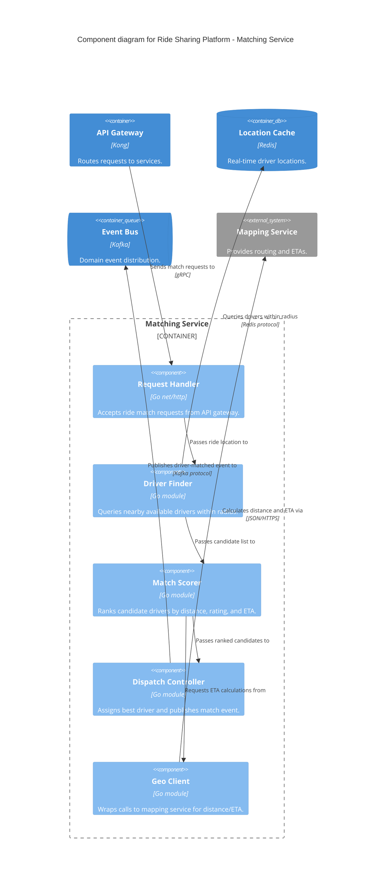

# Component Diagram

## Syntax

```
C4Component
    title Component diagram for {System Name} - {Container Name}
```

### Elements

```
Container(alias, "Label", "Technology", "Description")
Container_Ext(alias, "Label", "Technology", "Description")
ContainerDb(alias, "Label", "Technology", "Description")
System_Ext(alias, "Label", "Description")

Component(alias, "Label", "Technology", "Description")
Component_Ext(alias, "Label", "Technology", "Description")
ComponentDb(alias, "Label", "Technology", "Description")
ComponentQueue(alias, "Label", "Technology", "Description")
```

### Boundaries

```
Container_Boundary(alias, "Label") {
    ...components...
}
```

### Relationships

```
Rel(from, to, "Label", "Technology/Protocol")
Rel(from, to, "Label")
```

Within a container, relationships between components don't need protocol (same process). Relationships TO external containers still need protocol.

---

## Rules for This Level

- Scope: ONE container, zoomed in
- Shows logical groupings of functionality behind interfaces
- Components are NOT separately deployable — the container is the deployment unit
- Other containers shown as external context (single boxes, not decomposed)
- Only create this diagram if it adds value beyond the Container diagram
- Each component should represent a cohesive responsibility, not a package/namespace

---

## Example



---

## Post-Generation Check

- Is the diagram scoped to exactly one container?
- Does every component represent a cohesive responsibility (not a package/namespace)?
- Are external containers shown as single boxes (not decomposed)?
- Do relationships to external containers include protocol/technology?
- Does every element have a name, type, and description?
