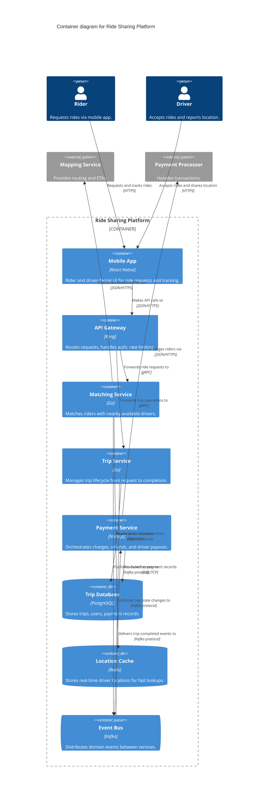

# Container Diagram

## Syntax

```
C4Container
    title Container diagram for {System Name}
```

### Elements

```
Person(alias, "Label", "Description")
System_Ext(alias, "Label", "Description")

Container(alias, "Label", "Technology", "Description")
Container_Ext(alias, "Label", "Technology", "Description")
ContainerDb(alias, "Label", "Technology", "Description")
ContainerDb_Ext(alias, "Label", "Technology", "Description")
ContainerQueue(alias, "Label", "Technology", "Description")
ContainerQueue_Ext(alias, "Label", "Technology", "Description")
```

### Boundaries

```
Container_Boundary(alias, "Label") {
    ...containers...
}
System_Boundary(alias, "Label") {
    ...containers...
}
```

### Relationships

```
Rel(from, to, "Label", "Technology/Protocol")
Rel_Back(from, to, "Label", "Technology/Protocol")
Rel_U(from, to, "Label", "Technology/Protocol")
Rel_D(from, to, "Label", "Technology/Protocol")
Rel_L(from, to, "Label", "Technology/Protocol")
Rel_R(from, to, "Label", "Technology/Protocol")
```

At container level, **inter-container relationships MUST include technology/protocol**.

---

## Rules for This Level

- Scope: one software system, zoomed in
- Every container specifies its technology
- External systems shown as single boxes (not decomposed)
- NO deployment details (no load balancers, clusters, replicas)
- Relationships between containers must show protocol (HTTP, gRPC, AMQP, JDBC, etc.)

---

## Example



---

## Post-Generation Check

- Does every container specify its technology?
- Does every inter-container relationship include protocol/technology?
- Are there zero deployment details (load balancers, clusters, replicas)?
- Are external systems shown as single boxes (not decomposed)?
- Does every element have a name, type, and description?
