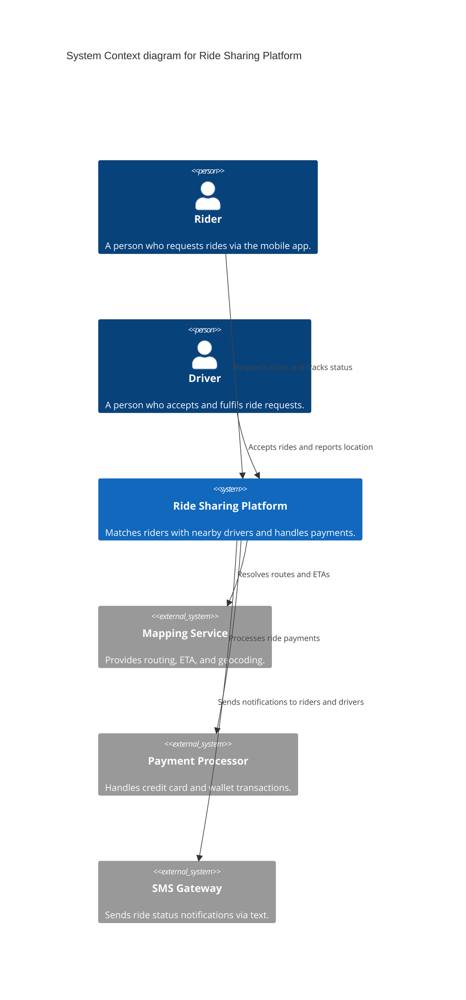

# System Context Diagram

## Syntax

```
C4Context
    title System Context diagram for {System Name}
```

### Elements

```
Person(alias, "Label", "Description")
Person_Ext(alias, "Label", "Description")
System(alias, "Label", "Description")
System_Ext(alias, "Label", "Description")
SystemDb_Ext(alias, "Label", "Description")
SystemQueue_Ext(alias, "Label", "Description")
```

### Boundaries (optional grouping)

```
Enterprise_Boundary(alias, "Label") {
    ...elements...
}
```

### Relationships

```
Rel(from, to, "Label")
BiRel(from, to, "Label")
```

At context level, relationships describe **intent** without technology details.

---

## Rules for This Level

- The focal system is centred/emphasised
- Only show: persons + external systems that directly interact
- NO internal containers — the system is a single box
- NO technology/protocol on relationships (high-level intent only)
- Keep it simple enough for non-technical stakeholders

---

## Example



---

## Post-Generation Check

- Does every element have a name, type, and description?
- Is the focal system clearly identifiable as the centre of the diagram?
- Are there zero containers or components in the diagram?
- Are relationship labels free of technology/protocol details?
- Could a non-technical stakeholder understand this diagram?
