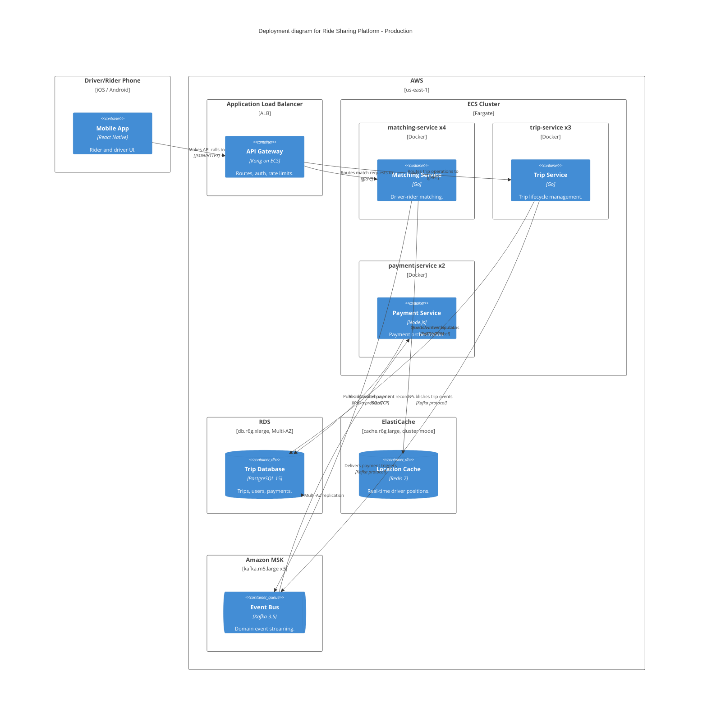

# Deployment Diagram

## Syntax

```
C4Deployment
    title Deployment diagram for {System Name} - {Environment}
```

### Elements

```
Deployment_Node(alias, "Label", "Type/Technology", "Description") {
    ...nested nodes or containers...
}
Node(alias, "Label", "Type", "Description") { ... }

Container(alias, "Label", "Technology", "Description")
ContainerDb(alias, "Label", "Technology", "Description")
ContainerQueue(alias, "Label", "Technology", "Description")
```

### Nesting

Deployment nodes nest inside each other to represent infrastructure hierarchy:

```
Deployment_Node(cloud, "AWS", "us-east-1") {
    Deployment_Node(cluster, "ECS Cluster", "Fargate") {
        Deployment_Node(task, "api-task x3", "Docker") {
            Container(api, "API Server", "Node.js", "Handles requests.")
        }
    }
}
```

### Relationships

```
Rel(from, to, "Label", "Technology/Protocol")
Rel_U(from, to, "Label", "Technology")
Rel_D(from, to, "Label", "Technology")
Rel_L(from, to, "Label", "Technology")
Rel_R(from, to, "Label", "Technology")
```

---

## Rules for This Level

- Scope: ONE deployment environment (production, staging, dev — not mixed)
- Shows how container **instances** map to infrastructure
- Deployment nodes can be nested (cloud > region > cluster > host > runtime)
- Include infrastructure nodes where relevant (DNS, load balancers, firewalls)
- Show replication (e.g. "api-service x3") in the node label
- Container instances inside deployment nodes are the same containers from the Container diagram
- This is orthogonal to the C4 zoom hierarchy — it answers "where does it run" not "what is it"

---

## Example



---

## Post-Generation Check

- Is the diagram scoped to exactly one deployment environment?
- Does every container instance live inside a deployment node?
- Is replication/scaling expressed in deployment node labels?
- Are deployment nodes nested to reflect the real infrastructure hierarchy?
- Does every element have a name, type, and description?
