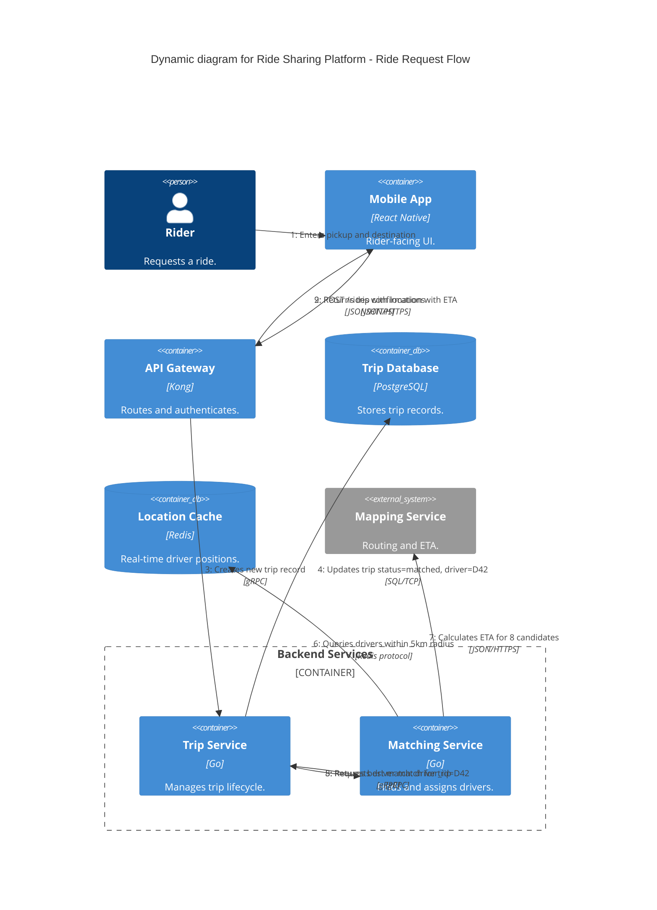

# Dynamic Diagram

## Syntax

```
C4Dynamic
    title Dynamic diagram for {System Name} - {Use Case}
```

### Elements

Use any elements from Context, Container, or Component levels — pick the abstraction that best illustrates the interaction:

```
Person(alias, "Label", "Description")
Container(alias, "Label", "Technology", "Description")
ContainerDb(alias, "Label", "Technology", "Description")
Component(alias, "Label", "Technology", "Description")
System_Ext(alias, "Label", "Description")
```

### Boundaries

```
Container_Boundary(alias, "Label") { ... }
System_Boundary(alias, "Label") { ... }
```

### Relationships

```
Rel(from, to, "Label", "Technology/Protocol")
```

**Sequence is determined by statement order.** Mermaid numbers interactions automatically based on the order `Rel` statements appear. Do NOT manually number them in labels.

### Styling (optional, for label positioning)

```
UpdateRelStyle(from, to, $textColor="...", $offsetX="...", $offsetY="...")
```

---

## Rules for This Level

- Scope: ONE specific feature, use case, or interaction pattern
- Shows how elements collaborate **at runtime** with ordered steps
- Can mix abstraction levels if needed (but prefer consistency)
- Statement order = sequence numbering (first Rel = step 1)
- Keep it focused — one flow per diagram, not the entire system
- Use sparingly: only for complex or non-obvious interactions

---

## Example



---

## Post-Generation Check

- Does `Rel` statement order match the logical execution sequence?
- Is the diagram scoped to one specific use case or feature?
- Does each step describe a specific action (not vague "uses" or "calls")?
- Are inter-container/inter-system relationships labelled with protocol?
- Does every element have a name, type, and description?
